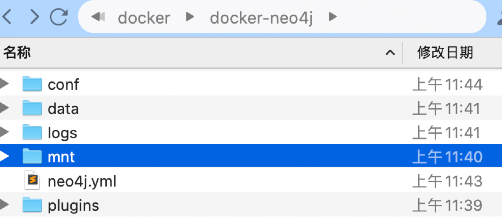

# Docker-neo4j部署教程



```
version: '3'
services:

  neo4j:
    image: neo4j
    volumes:
      - ./conf:/var/lib/neo4j/conf
      - ./mnt:/var/lib/neo4j/import
      - ./plugins:/plugins
      - ./data:/data
      - ./logs:/var/lib/neo4j/logs
    restart: always
    ports:
      - 7474:7474
      - 7687:7687
    environment:
      - NEO4J_dbms_memory_heap_maxSize=4G
      - NEO4J_AUTH=neo4j/123456  #修改默认用户密码
      
```


在volumes中映射本地相应文件挂载即可

admin-import导入数据：

1. 启动容器 

2. 进入容器内，删除data/databases 和data/transaction内的全部文件，

3. 在bin下执行admin-import 命令 ，不要带数据库名字 ，会加载到默认的数据库中

4. ./neo4j-admin import --nodes ../import/predicates/entity/entity.csv --relationships ../import/predicates/rel/rel.csv --skip-bad-relationships --skip-duplicate-nodes=true --high-io=true

5. exit容器，restart容器

6. 如果容器内外做了端口映射，比如：

7. ports:

​      \- 8474:7474

​      \- 8687:7687

​      那么在8474登录可视化界面时，需要将连接的服务改成 8687，否则连接失败！